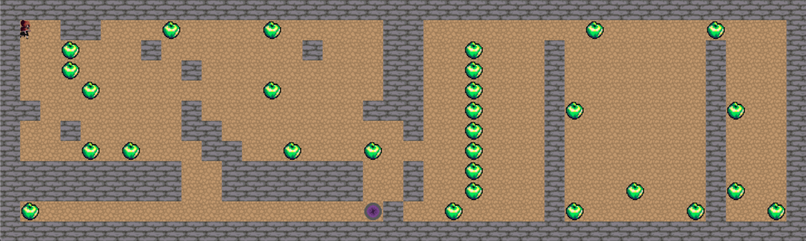

### Game is playable only on Intel MacOS and Linux systems.
### Other OS are not supported.
### If you are on a Linux system you can download this version of MiniLibX : https://github.com/42Paris/minilibx-linux 
### Don't forget to keep on the root of the project this libmlx.dylib file.

## Run the game : make && ./solong.a "Map_of_your_choice.ber"
For example : make && ./solong.a "map2.ber"

If map does'nt exists it will print an error.
The map have to finish with ".ber" extension

Have fun :)
